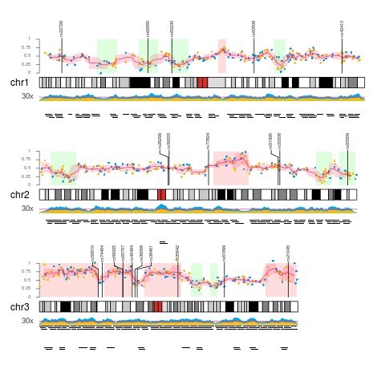

## R/Bioconductor packages for chromosome-wide visualization

We discuss 3 R/Bioconductor packages that can be used to visualize genome-wide data:
KaryoploteR, ggbio and IdeoViz.

### KaryoploteR

https://bernatgel.github.io/karyoploter_tutorial/

- plots with nice aesthetics
- documentation quite good
- requires R version >= 3.4

https://bernatgel.github.io/karyoploter_tutorial//Examples/MultipleDataTypes/MultipleDataTypes.html

#### Many different types of plots
kpPlotBAMDensity   kpPlotGenes        kpPlotMarkers      kpPlotRegions
kpPlotCoverage     kpPlotLinks        kpPlotNames        kpPlotRibbon
kpPlotDensity      kpPlotLoess        kpPlotRainfall     kpPlotTranscripts  

#### Installation
source("https://bioconductor.org/biocLite.R")
biocLite("karyoploteR")

-------------------------------------------
### IdeoViz

https://www.bioconductor.org/packages/release/bioc/html/IdeoViz.html

more examples:
https://www.bioconductor.org/packages/release/bioc/vignettes/IdeoViz/inst/doc/Vignette.pdf

#### Installation
## try http:// if https:// URLs are not supported
source("https://bioconductor.org/biocLite.R")
biocLite("IdeoViz")

----------------------------------------------

### ggbio

https://bioconductor.org/packages/release/bioc/html/ggbio.html

- syntax like ggplot2
- not under active development

More examples   
- example http://www.tengfei.name/ggbio/docs/man/layout_karyogram-method.html  
- http://www.sthda.com/english/wiki/ggbio-visualize-genomic-data  
- http://rstudio-pubs-static.s3.amazonaws.com/9418_48ced8100f784734be7541bdda5da402.html#/20  

### Installation
source("http://www.bioconductor.org/biocLite.R")
biocLite("ggbio")
